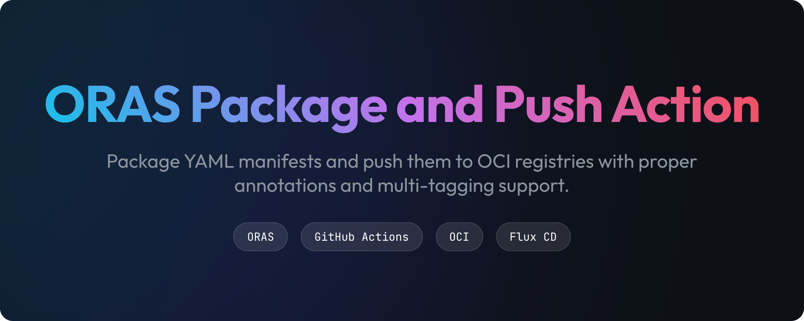
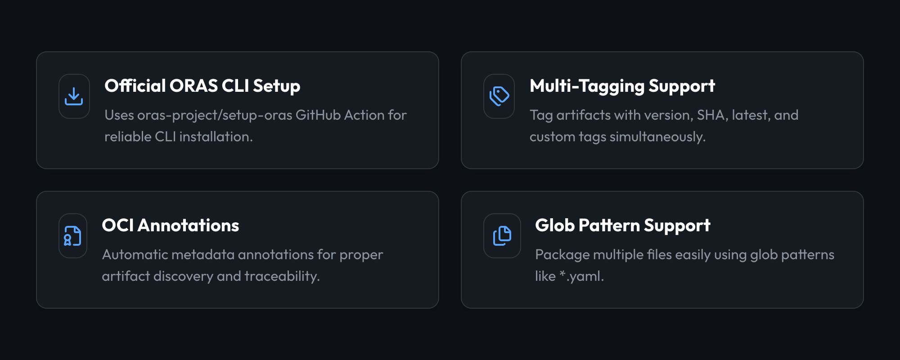
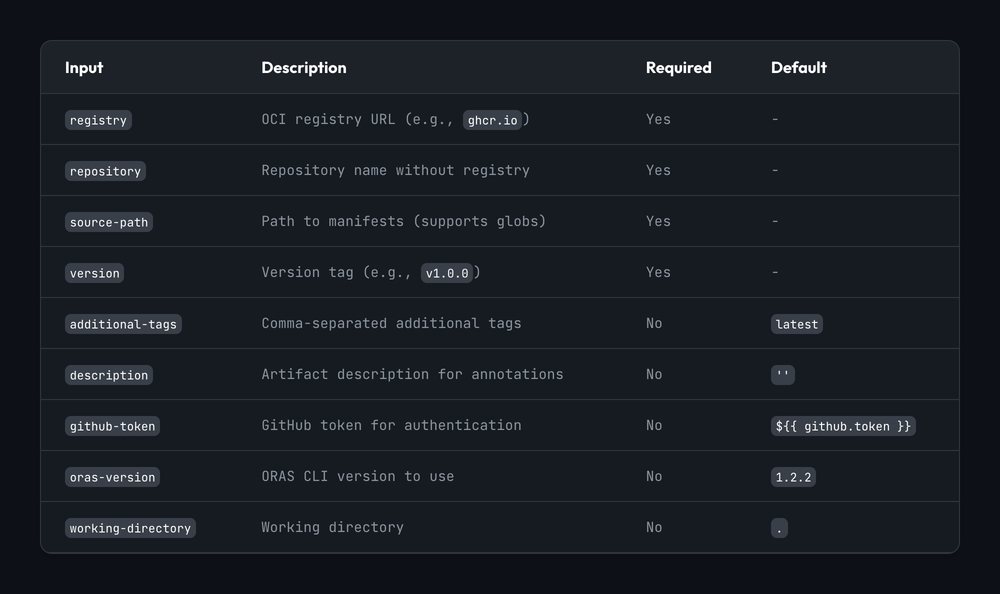
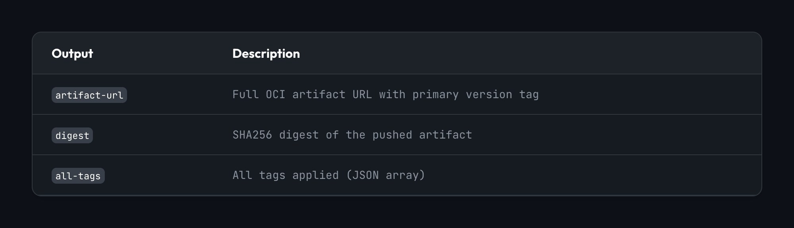

A GitHub Action that packages YAML manifests and pushes them to OCI registries as artifacts with proper annotations and multi-tagging support.

## Features




<!-- - ✅ **Official ORAS CLI setup** - Uses oras-project/setup-oras GitHub Action
- ✅ **Multi-tagging support** - Tag with version, SHA, latest, etc.
- ✅ **OCI annotations** - Proper metadata for artifact discovery
- ✅ **Glob patterns** - Package multiple files easily
- ✅ **GitHub Container Registry integration** - Works seamlessly with ghcr.io
- ✅ **Detailed outputs** - Get artifact URL, digest, and all tags -->

## Usage

> [!TIP]
> Check out the [examples/workflows/](examples/workflows/) directory for usage examples.

## Inputs



<!-- | Input | Description | Required | Default |
|-------|-------------|----------|---------|
| `registry` | OCI registry URL (e.g., `ghcr.io`) | Yes | - |
| `repository` | Repository name without registry | Yes | - |
| `source-path` | Path to manifests (supports globs) | Yes | - |
| `version` | Version tag (e.g., `v1.0.0`) | Yes | - |
| `additional-tags` | Comma-separated additional tags | No | `latest` |
| `description` | Artifact description for annotations | No | `''` |
| `github-token` | GitHub token for authentication | No | `${{ github.token }}` |
| `oras-version` | ORAS CLI version to use | No | `1.2.2` |
| `working-directory` | Working directory | No | `.` | -->


## Outputs



<!-- | Output | Description |
|--------|-------------|
| `artifact-url` | Full OCI artifact URL with primary version tag |
| `digest` | SHA256 digest of the pushed artifact |
| `all-tags` | All tags applied (JSON array) | -->

## How It Works

1. **Setup**: Installs ORAS CLI
2. **Login**: Authenticates to the OCI registry
3. **Package**: Finds files matching the glob pattern
4. **Annotate**: Adds OCI annotations (version, revision, source)
5. **Push**: Pushes artifact with primary version tag
6. **Tag**: Applies additional tags (latest, SHA, etc.)

## OCI Annotations

The action automatically adds these OCI annotations:

- `org.opencontainers.image.version` - Version tag
- `org.opencontainers.image.revision` - Git commit SHA
- `org.opencontainers.image.source` - GitHub repository URL
- `org.opencontainers.image.description` - Custom description (if provided)

## Consuming the Artifacts

### With ORAS CLI

```bash
oras pull ghcr.io/owner/repo/artifact:v1.0.0
```

### With Flux CD

```yaml
apiVersion: source.toolkit.fluxcd.io/v1beta2
kind: OCIRepository
metadata:
  name: my-manifests
spec:
  url: oci://ghcr.io/owner/repo/artifact
  ref:
    tag: v1.0.0
```

### With Kustomize (after pulling)

```bash
oras pull ghcr.io/owner/repo/artifact:v1.0.0
kustomize build . | kubectl apply -f -
```

## Examples

Check the [`examples/workflows/`](./examples/workflows/) directory for:
- Basic usage
- GitVersion integration
- Matrix builds
- Multi-environment setups

## Contributing

See [CONTRIBUTING.md](./CONTRIBUTING.md) for development guidelines.

## License

MIT License - see [LICENSE](./LICENSE) for details
